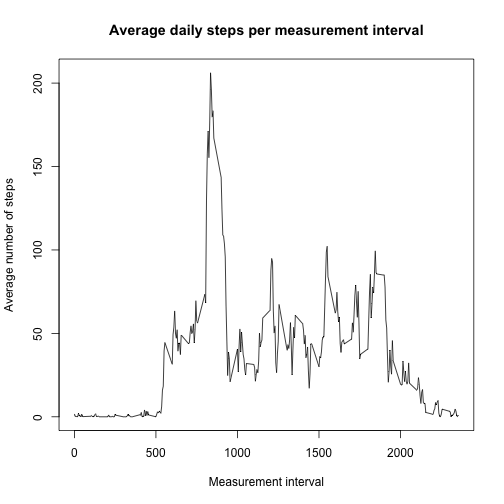
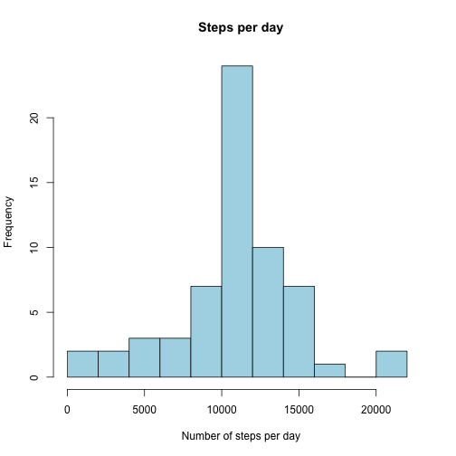
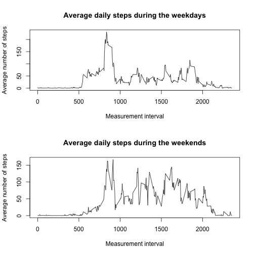

This is an R Markdown document containing the Peer Review Asignment 1 from the Coursera course reproducible Research (repdata-012). 

## 1. Loading and preprocessing the data
  
The file containing the original data (**activity.csv**) was read into R. The steps variable was transformed into numeric values, and the datevariable was transformed into the date type.
  

```r
# Load needed libraries
library(knitr)

# Set the home directory
home <- getwd()

# Load the activity.csv data file. This file should be located in the home
# directory
data <- read.csv(file.path(home, "activity.csv"))

# Convert the steps data into numeric data
data <- transform(data, steps = as.numeric(steps))

# Convert the date data into date type
data <- transform(data, date = as.Date(date, "%Y-%m-%d"))
```

## 2. What is the mean total number of steps taken per day? 

The number of total step per day logged from the **activity.csv** file are presented in the following table.


```r
# Total number of steps per day
stepsDay <- aggregate(data$steps, list(date = data$date), sum, na.rm = TRUE)

# Histogram of steps per day
hist(stepsDay$x, breaks = 15, xlim = c(0, 22500), col = "lightblue", main = "Steps per day", 
    xlab = "Number of steps per day")
```

 
 
The mean value of the total number of steps taken per day is **9354.23** while the median value is **1.0395 &times; 10<sup>4</sup>**.
  
## 3. What is the average daily acivity pattern?
  
The average number of steps per 5-min interval is presented in the following plot.  


```r
# Total number of steps per interval
stepsInterval <- aggregate(data$steps, list(interval = data$interval), mean, 
    na.rm = TRUE)

plot(stepsInterval$interval, stepsInterval$x, type = "l", main = "Average daily steps per measurement interval", 
    xlab = "Measurement interval", ylab = "Average number of steps")
```

 
  
The maximum period of activity among the data happens during the **835** interval.  
  
## 4. Missing values

In the original data there are a total of **2304** intervals with missing values. 
    
The missing values from the original data were replaced with the mean activity for the given interval from all the days that had data available.


```r
# Combine the original data and the mean for the interval data frames
dataNoNA <- merge(data, stepsInterval, by.x = "interval")

# Substitute the NA with the mean acitvity for the specific interval
for (i in 1:nrow(dataNoNA)) {
    if (is.na(dataNoNA[i, "steps"] == "TRUE")) {
        dataNoNA[i, "steps"] <- dataNoNA[i, "x"]
    }
}

dataNoNA <- dataNoNA[, 1:3]

# Total number of steps per day
stepsDayNoNA <- aggregate(dataNoNA$steps, list(date = dataNoNA$date), sum, na.rm = TRUE)

# Histogram of steps per day
hist(stepsDayNoNA$x, breaks = 15, xlim = c(0, 22500), col = "lightblue", main = "Steps per day", 
    xlab = "Number of steps per day")
```

 
  
The mean value of the total number of steps taken per day when the missing data is replaced by the average activity per interval is **1.0766189 &times; 10<sup>4</sup>** while the median value is **1.0766189 &times; 10<sup>4</sup>**. These values are slightly higher than the original calculated values, when missing data was present in the dataset. Moreover, after replacing the missing values the mean and median values appeared to be the same.
  
## 5. Are there differences in activity patterns between weekdays and weekends??


```r
# Convert the date data into date type
dataNoNA <- transform(dataNoNA, date = as.Date(date, "%Y-%m-%d"))

dataNoNA$Weekday <- weekdays(dataNoNA$date)

for (i in 1:nrow(dataNoNA)) {
    if (dataNoNA[i, "Weekday"] == "Saturday") {
        dataNoNA[i, "Day"] <- "weekend"
    } else if (dataNoNA[i, "Weekday"] == "Sunday") {
        dataNoNA[i, "Day"] <- "weekend"
    } else dataNoNA[i, "Day"] <- "weekday"
}

dataNoNA$Day <- as.factor(dataNoNA$Day)

# Total number of steps per interval
stepsNoNAInterval <- aggregate(dataNoNA$steps, list(interval = dataNoNA$interval, 
    Day = dataNoNA$Day), mean, na.rm = TRUE)

# Plot daily activity per day
par(mfrow = c(2, 1))
with(subset(stepsNoNAInterval, Day == "weekday"), plot(interval, x, type = "l", 
    main = "Average daily steps during the weekdays", xlab = "Measurement interval", 
    ylab = "Average number of steps"))
with(subset(stepsNoNAInterval, Day == "weekend"), plot(interval, x, type = "l", 
    main = "Average daily steps during the weekends", xlab = "Measurement interval", 
    ylab = "Average number of steps"))
```

 
